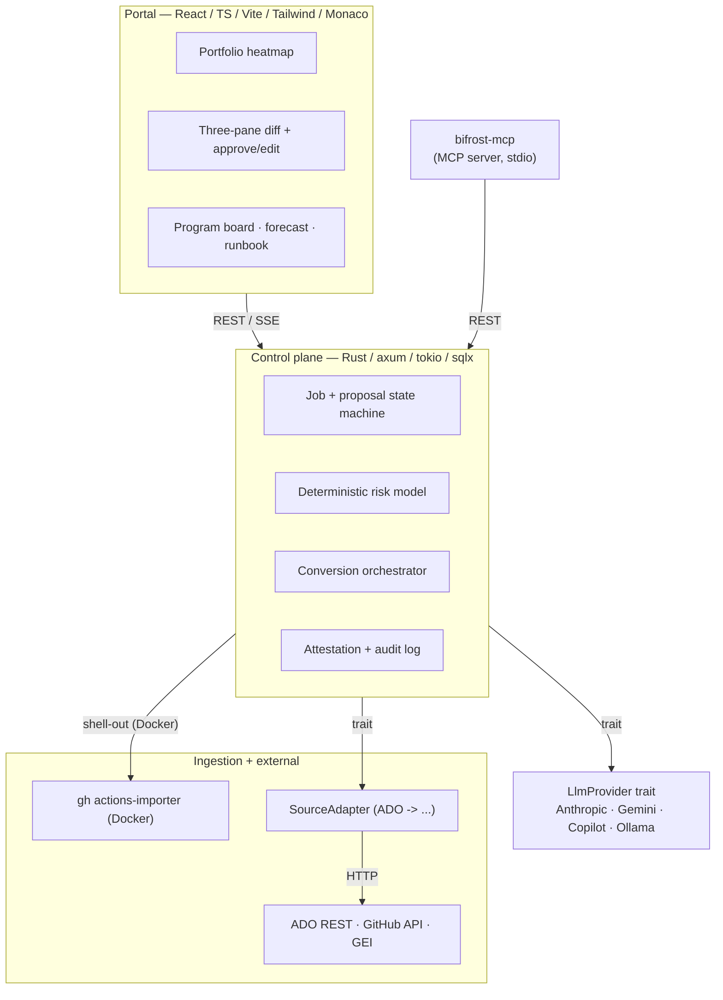
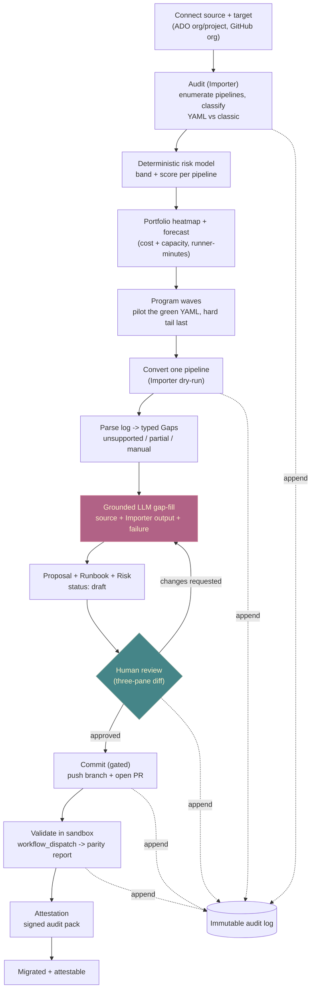
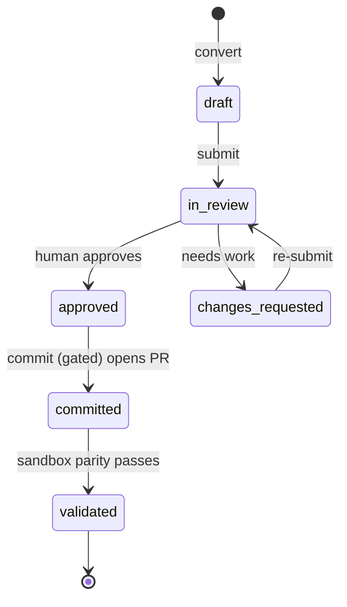
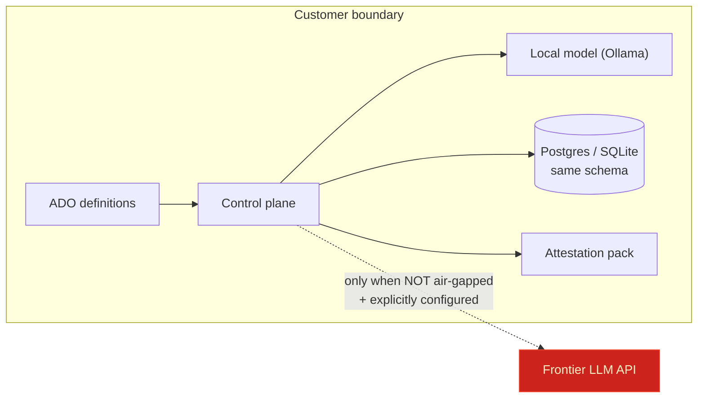

# Architecture
{: .fs-9 }

How Bifrost is built, how a migration flows from end to end, and — for every significant
decision — why it was made that way.
{: .fs-6 .fw-300 }

---

## The shape of the system

Bifrost is an orchestration + intelligence layer on top of GitHub's official migration CLIs
(`gh actions-importer`, GEI / `ado2gh`). It never reimplements their conversion logic — it
**wraps** them, then adds the portfolio orchestration, the semantic review, the deterministic
risk model, the human-approval workflow, and the attestation trail.

It is organised as three planes.

- **Portal** — the human surface: a portfolio heatmap, the three-pane review diff
  (source ADO YAML · Importer output · Bifrost's augmented workflow), approve/edit, the
  program board, the forecast, and the per-pipeline runbook.
- **Control plane** — the brain: the job and proposal state machines, the conversion
  orchestrator, the deterministic risk model, and the attestation + audit log. It owns all
  trust decisions; everything else is an edge.
- **Ingestion + external** — the hands: the official Importer shelled out in Docker, the
  `SourceAdapter` trait (Azure DevOps first, platform-agnostic by design), and the external
  APIs (ADO REST, GitHub, GEI).

Two more edges hang off the control plane: the **`LlmProvider` trait** (the only way
orchestration talks to a model) and **`bifrost-mcp`** (the MCP server that lets an IDE agent
drive the same API — see the [editor guide](/mcp)).

### Crates

| Crate | Responsibility |
|-------|----------------|
| `bifrost-core` | Domain types, the job/proposal state machine, the deterministic risk model, forecast/completeness/readiness/program/program-board planners. Depends on nothing else. |
| `bifrost-adapters` | `SourceAdapter` trait + `AzureDevOpsAdapter`; the Importer wrapper (`dry-run`, log parsing). |
| `bifrost-llm` | `LlmProvider` trait + impls (Anthropic, Gemini, Copilot/GitHub Models, Ollama, Azure OpenAI, Vertex, OpenAI-compatible) + the air-gap-enforcing router. |
| `bifrost-api` | The axum control-plane API + SSE, auth, persistence, job orchestration. |
| `bifrost-cli` | CLI entrypoint (audit, convert, report). |
| `bifrost-mcp` | The MCP server (stdio JSON-RPC) that proxies the API for IDE agents. |

---

## A migration, start to end

The golden path is GitHub's documented sequence — `configure → audit → forecast → dry-run →
migrate` — wrapped with a review-first loop and an attestation trail. Every blue node is
deterministic; the single model step is grounded and produces a *proposal*, never a merged
change; the diamond is the human gate.

The core conversion loop (the middle band) per pipeline: Importer `dry-run` → parse the log
into typed **Gap** records → build a grounded LLM request per gap → assemble the augmented
workflow + rationale + deterministic risk → persist as a **Proposal** awaiting review. Nothing
touches the target repo until a human approves and the gated commit runs.

---

## The proposal lifecycle

Every proposal moves through an explicit state machine. Illegal transitions are rejected, and
**every** transition is appended to the audit log with actor + timestamp.

The terminal `validated` state is itself gated: a proposal cannot validate while any
*required* runbook task (a secret to create, a service connection to federate) is still open.

---

## Trust and data model

Bifrost is designed for environments where the pipeline definitions themselves are sensitive
(they leak infrastructure topology and secret *names*). The trust model follows from that.

- **Air-gap capable.** With air-gap mode on, the `LlmProvider` router forces every call to a
  local model; frontier providers are disabled by config and **no pipeline data leaves the
  box**. There is an explicit test target asserting zero external calls in air-gap mode.
- **Secret names, never values.** Variable groups and service connections are recorded by
  name + type only. Secret *values* are never fetched or stored.
- **Everything is attestable.** Every state transition and human action is appended to an
  immutable audit log; a migration exports as a signed attestation pack.
- **Same schema over two stores.** Postgres for the multi-tenant server, SQLite for the local
  / air-gap install — one schema, so behaviour is identical.

---

## Why these choices

The decisions that shape Bifrost, and the reasoning behind each.

| Decision | Why | Trade-off accepted |
|----------|-----|--------------------|
| **Wrap the official tools; never fork** | GitHub already does ~90% of the syntactic conversion and maintains it across ADO/Jenkins/GitLab. Reimplementing it would be a maintenance treadmill we'd always lose. | We inherit the Importer's limitations and shell out to Docker. We pin tool versions + image digests per job so it stays reproducible. |
| **Deterministic risk; the LLM never scores** | Risk drives human prioritisation and must be explainable, reproducible, and auditable. A model's number is none of those. | The risk model is hand-built and must be tuned from fixtures, not learned. |
| **Grounded generation only** | The model fills a *gap* from the source + the Importer's output + the specific failure — it never converts from scratch. This bounds hallucination to a reviewable diff. | The model cannot "be creative"; it is deliberately constrained to the gap. |
| **Review-first, never autonomous** | Silently rewriting production CI is unacceptable in an enterprise. Bifrost recommends and explains; commit is opt-in behind human approval + validation. | Slower than full auto — by design. The human stays in the loop. |
| **Air-gap as a first-class mode** | Pipeline YAML is sensitive. Customers must be able to run with a local model only and prove nothing leaves. | Local models are weaker; routing sends hard reasoning to frontier only when allowed. |
| **`SourceAdapter` + `LlmProvider` traits** | Keep platform and vendor out of the core. ADO is just the first adapter; Anthropic/Ollama/etc. are just impls. Orchestration calls only the trait. | An indirection layer, justified by testability (everything mockable) and portability. |
| **Attestation as a feature, not logging** | Regulated migrations need to prove what happened, who approved it, and with which tool versions. | Every transition must be appended immutably — a discipline, not an afterthought. |
| **Postgres *or* SQLite, one schema** | Server multi-tenancy needs Postgres; the local/air-gap box needs zero-dependency SQLite. | Queries stay portable across both via `sqlx`. |
| **MCP server is review-first too** | Letting an IDE agent drive the migration is powerful; letting it merge is dangerous. Context tools are read-only; convert produces a proposal; commit is triple-gated. | The agent cannot self-approve — approval is always a human action in the portal. |
| **Opt-in everything (auth, live LLM, live commit, live validate)** | Out of the box it must work with zero config and zero external effect (mock providers, open auth). Every live/paid/outward path is an explicit env opt-in. | Operators must consciously enable production behaviour — the safe default is inert. |

See the [decisions log](https://github.com/olafkfreund/bifrost/blob/main/bifrost-implementation-plan.md)
for the full design (the plan's section numbers are referenced throughout the codebase).

---

## Stack

Rust (axum, tokio, sqlx) · Postgres (server) / SQLite (local, air-gap) · the official Importer
Docker image shelled out as a subprocess · React / TS / Vite / Tailwind / Monaco · MCP
(stdio JSON-RPC) for IDEs · Entra ID OIDC SSO (opt-in) · Docker Compose and Helm for deploy ·
MIT licensed.

Where to go next: the [golden path](/golden-path) (how Bifrost maps to GitHub's documented
sequence), the [editor guide](/mcp) (driving it from VS Code), and the
[roadmap](/roadmap).
